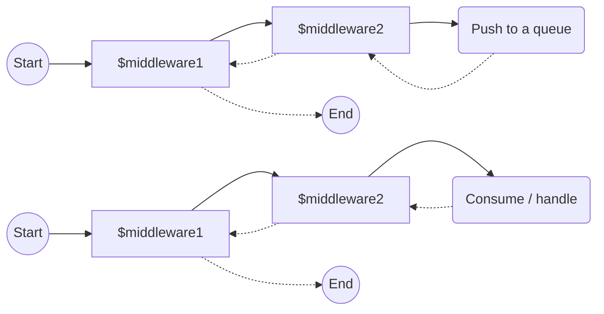

<p align="center">
    <a href="https://github.com/yiisoft" target="_blank">
        
    </a>
    <h1 align="center">Yii Queue</h1>
    <br>
</p>

[](https://packagist.org/packages/yiisoft/queue)
[](https://packagist.org/packages/yiisoft/queue)
[](https://github.com/yiisoft/queue/actions)
[](https://codecov.io/gh/yiisoft/queue)
[](https://dashboard.stryker-mutator.io/reports/github.com/yiisoft/queue/master)
[](https://github.com/yiisoft/queue/actions?query=workflow%3A%22static+analysis%22)
[](https://shepherd.dev/github/yiisoft/queue)

An extension for running tasks asynchronously via queues.

## Requirements

- PHP 8.1 or higher.
- PCNTL extension for signal handling _(optional, recommended for production use)_

## Installation

The package could be installed with [Composer](https://getcomposer.org):

```shell
composer require yiisoft/queue
```

## Quick Start

### 1. Install an adapter

For production use, you should install an adapter package that matches your message broker ([AMQP](https://github.com/yiisoft/queue-amqp), [Kafka](https://github.com/g41797/queue-kafka), [NATS](https://github.com/g41797/queue-nats), and [others](docs/guide/en/adapter-list.md)).
See the [adapter list](docs/guide/en/adapter-list.md) and follow the adapter-specific documentation.

For development and testing, you can start without an external broker using the built-in [`SynchronousAdapter`](docs/guide/en/adapter-sync.md).
This adapter processes messages immediately in the same process, so it won't provide true async execution,
but it's useful for getting started and writing tests.

### 2. Configure the queue

#### Configuration with [yiisoft/config](https://github.com/yiisoft/config)

**If you use [yiisoft/app](https://github.com/yiisoft/app) or [yiisoft/app-api](https://github.com/yiisoft/app-api)**

Add queue configuration to your application `$params` config. In [yiisoft/app](https://github.com/yiisoft/app)/[yiisoft/app-api](https://github.com/yiisoft/app-api) templates it's typically the `config/params.php` file.  
_If your project structure differs, put it into any params config file that is loaded by [yiisoft/config](https://github.com/yiisoft/config)._ 

Minimal configuration example:

```php
return [
    'yiisoft/queue' => [
        'handlers' => [
            'handler-name' => [FooHandler::class, 'handle'],
        ],
    ],
];
```

[Advanced configuration with `yiisoft/config`](docs/guide/en/configuration-with-config.md)

#### Manual configuration

For setting up all classes manually, see the [Manual configuration](docs/guide/en/configuration-manual.md) guide.

### 3. Prepare a handler

You need to create a handler class that will process the queue messages. The most simple way is to implement the `HandleInterface`. Let's create an example for remote file processing:

```php
use Yiisoft\Queue\Handler\HandleInterface;
use Yiisoft\Queue\Message\MessageInterface;

final readonly class RemoteFileHandler implements HandleInterface
{
    private string $absolutePath;

    // These dependencies will be resolved on handler creation by the DI container
    public function __construct(
        private FileDownloader $downloader,
        private FileProcessor $processor,
    ) {}

    // Every received message will be processed by this method
    public function handle(MessageInterface $downloadMessage): void
    {
        $fileName = $downloadMessage->getData()['destinationFile'];
        $localPath = $this->downloader->download($fileName);
        $this->processor->process($localPath);
    }
}
```

### 4. Send (produce/push) a message to a queue

To send a message to the queue, you need to get the queue instance and call the `push()` method. Typically, with Yii Framework you'll get a `Queue` instance as a dependency of a service.

```php

final readonly class Foo {
    public function __construct(private QueueInterface $queue) {}
    
    public function bar(): void
    {
        $this->queue->push(new Message(
            // The first parameter is the handler name that will process this concrete message
            RemoteFileHandler::class,
            // The second parameter is the data that will be passed to the handler.
            // It should be serializable to JSON format
            ['destinationFile' => 'https://example.com/file-path.csv'],
        ));
    }
}
```

### 5. Handle queue messages

By default, Yii Framework uses [yiisoft/yii-console](https://github.com/yiisoft/yii-console) to run CLI commands. If you installed [yiisoft/app](https://github.com/yiisoft/app) or [yiisoft/app-api](https://github.com/yiisoft/app-api), you can run the queue worker with on of these two commands:

```bash
./yii queue:run # Handle all existing messages in the queue
./yii queue:listen # Start a daemon listening for new messages permanently
```

> In case you're using the `SynchronosAdapter` for development purposes, you should not use these commands, as you have no asynchronous processing available. The messages are processed immediately when pushed.

## Differences to [yiisoft/yii2-queue](https://github.com/yiisoft/yii2-queue)

If you have experience with [yiisoft/yii2-queue](https://github.com/yiisoft/yii2-queue), you will find out that this package is similar.
Though, there are some key differences that are described in the [Migrating from yii2-queue](docs/guide/migrating-from-yii2-queue.md) article.

## General usage

Each queue task consists of two parts:

1. A message is a class implementing `MessageInterface`. For simple cases you can use the default implementation,
   `Yiisoft\Queue\Message\Message`. For more complex cases, you should implement the interface by your own.
2. A message handler is a callable called by a `Yiisoft\Queue\Worker\Worker`. The handler handles each queue message.

For example, if you're going to download and save a file in a queue task, your message creation may look like the following:
- Message handler as the first parameter
- Message data as the second parameter

```php
$data = [
    'url' => $url,
    'destinationFile' => $filename,
];
$message = new \Yiisoft\Queue\Message\Message(FileDownloader::class, $data);
```

Then you should push it to the queue:

```php
$queue->push($message);
```

Its handler may look like the following:

```php
class FileDownloader
{
    private string $absolutePath;

    public function __construct(string $absolutePath) 
    {
        $this->absolutePath = $absolutePath;
    }

    public function handle(\Yiisoft\Queue\Message\MessageInterface $downloadMessage): void
    {
        $fileName = $downloadMessage->getData()['destinationFile'];
        $path = "$this->absolutePath/$fileName"; 
        file_put_contents($path, file_get_contents($downloadMessage->getData()['url']));
    }
}
```

The last thing we should do is to create a configuration for the `Yiisoft\Queue\Worker\Worker`:

```php
$worker = $container->get(\Yiisoft\Queue\Worker\WorkerInterface::class);
$queue = $container->get(\Yiisoft\Queue\Provider\QueueProviderInterface::class)->get('channel-name');
```

There is a way to run all the messages that are already in the queue, and then exit:

```php
$queue->run(); // this will execute all the existing messages
$queue->run(10); // while this will execute only 10 messages as a maximum before exit
```

If you don't want your script to exit immediately, you can use the `listen` method:

```php
$queue->listen();
```

You can also check the status of a pushed message (the queue adapter you are using must support this feature):

```php
$message = $queue->push($message);
$id = $message->getMetadata()[\Yiisoft\Queue\Message\IdEnvelope::MESSAGE_ID_KEY];

// Get status of the job
$status = $queue->status($id);

// Check whether the job is waiting for execution.
$status === \Yiisoft\Queue\JobStatus::WAITING;

// Check whether a worker got the job from the queue and executes it.
$status === \Yiisoft\Queue\JobStatus::RESERVED;

// Check whether a worker has executed the job.
$status === \Yiisoft\Queue\JobStatus::DONE;
```

## Custom handler names

By default, when you push a message to the queue, the message handler name is the fully qualified class name of the handler.
This can be useful for most cases, but sometimes you may want to use a shorter name or arbitrary string as the handler name.
This can be useful when you want to reduce the amount of data being passed or when you communicate with external systems.

To use a custom handler name before message push, you can pass it as the first argument `Message` when creating it:

```php
new Message('handler-name', $data);
```

To use a custom handler name on message consumption, you should configure handler mapping for the `Worker` class:

```php
$params['yiisoft/queue']['handlers'] = [
    'handler-name' => FooHandler::class,
];
```

## Different queue channels

Often we need to push to different queue channels with an only application. There is the `QueueProviderInterface`
interface that provides different `Queue` objects creation for different channels. With implementation of this interface
channel-specific `Queue` creation is as simple as

```php
$queue = $provider->get('channel-name');
```

You can also check if a channel exists before trying to get it:

```php
if ($provider->has('channel-name')) {
    $queue = $provider->get('channel-name');
}
```

`QueueProviderInterface::get()` may throw `ChannelNotFoundException`, `InvalidQueueConfigException` or `QueueProviderException`.

Out of the box, there are three implementations of the `QueueProviderInterface`:

- `AdapterFactoryQueueProvider`
- `PrototypeQueueProvider`
- `CompositeQueueProvider`

### `AdapterFactoryQueueProvider`

Provider based on the definition of channel-specific adapters. Definitions are passed in
the `$definitions` constructor parameter of the factory, where keys are channel names and values are definitions
for the [`Yiisoft\Factory\Factory`](https://github.com/yiisoft/factory). Below are some examples:

```php
use Yiisoft\Queue\Adapter\SynchronousAdapter;

[
    'channel1' => new SynchronousAdapter(),
    'channel2' => static fn(SynchronousAdapter $adapter) => $adapter->withChannel('channel2'),
    'channel3' => [
        'class' => SynchronousAdapter::class,
        '__constructor' => ['channel' => 'channel3'],
    ],
]
```

For more information about the definition formats available, see the [factory](https://github.com/yiisoft/factory) documentation.

### `PrototypeQueueProvider`

Queue provider that only changes the channel name of the base queue. It can be useful when your queues used the same
adapter.

> Warning: This strategy is not recommended as it does not give you any protection against typos and mistakes
> in channel names.

### `CompositeQueueProvider`

This provider allows you to combine multiple providers into one. It will try to get a queue from each provider in the
order they are passed to the constructor. The first queue found will be returned.

## Console execution

This package provides queue abstractions and includes a `SynchronousAdapter` for development and test environments.
To run a real queue backend, install one of the adapter packages listed in the [guide](docs/guide/en/adapter-list.md).

The exact way of task execution depends on the adapter used. Most adapters can be run using console commands.
If you are using [yiisoft/config](https://github.com/yiisoft/config) with [yiisoft/yii-console](https://github.com/yiisoft/yii-console), the component automatically registers the commands.

The following command obtains and executes tasks in a loop until the queue is empty:

```sh
yii queue:run [channel1 [channel2 [...]]] --maximum=100
```

The following command launches a daemon which infinitely queries the queue:

```sh
yii queue:listen [channel]
```

The following command iterates through multiple channels and is meant to be used in development environment only:

```sh
yii queue:listen:all [channel1 [channel2 [...]]] --pause=1 --maximum=0
```

For long-running processes, graceful shutdown is controlled by `LoopInterface`. When `ext-pcntl` is available,
the default `SignalLoop` handles signals such as `SIGTERM`/`SIGINT`.

See the documentation for more details about adapter specific console commands and their options.

The component can also track the status of a job which was pushed into queue.

For more details, see [the guide](docs/guide/en/README.md).

## Debugging

If you use [yiisoft/yii-debug](https://github.com/yiisoft/yii-debug), the package provides a `QueueCollector` that can
collect message pushes, `status()` calls and message processing by the worker. The defaults are already present in
[`config/params.php`](config/params.php).

## Middleware pipelines

Any message pushed to a queue or consumed from it passes through two different middleware pipelines: one pipeline
on message push and another - on a message consume. The process is the same as for the HTTP request, but it is executed
twice for a queue message. That means you can add extra functionality on message pushing and consuming with configuration
of the two classes: `PushMiddlewareDispatcher` and `ConsumeMiddlewareDispatcher` respectively.

You can use any of these formats to define a middleware:

- A ready-to-use middleware object: `new FooMiddleware()`. It must implement `MiddlewarePushInterface`,
 `MiddlewareConsumeInterface` or `MiddlewareFailureInterface` depending on the place you use it.
- An array in the format of [yiisoft/definitions](https://github.com/yiisoft/definitions).
- A `callable`: `fn() => // do stuff`, `$object->foo(...)`, etc. It will be executed through the
[yiisoft/injector](https://github.com/yiisoft/injector), so all the dependencies of your callable will be resolved.
- A string for your DI container to resolve the middleware, e.g. `FooMiddleware::class`

Middleware will be executed forwards in the same order they are defined. If you define it like the following:
`[$middleware1, $midleware2]`, the execution will look like this:



### Push a pipeline

When you push a message, you can use middlewares to modify both message and queue adapter.
With message modification you can add extra data, obfuscate data, collect metrics, etc.  
With queue adapter modification you can redirect the message to another queue, delay message consuming, and so on.

To use this feature, you have to create a middleware class, which implements `MiddlewarePushInterface`, and
return a modified `PushRequest` object from the `processPush` method:

```php
return $pushRequest->withMessage($newMessage)->withAdapter($newAdapter);
```

With push middlewares you can define an adapter object at the runtime, not in the `Queue` constructor.
There is a restriction: by the time all middlewares are executed in the forward order, the adapter must be specified
in the `PushRequest` object. You will get a `AdapterNotConfiguredException`, if it isn't.

You have three places to define push middlewares:

1. `PushMiddlewareDispatcher`. You can pass it either to the constructor, or to the `withMiddlewares()` method, which  
creates a completely new dispatcher object with only those middlewares, which are passed as arguments.
If you use [yiisoft/config](https://github.com/yiisoft/config), you can add middleware to the `middlewares-push` key of the
[`yiisoft/queue`](https://github.com/yiisoft/queue) array in the `params`.
2. Pass middlewares to either `Queue::withMiddlewares()` or `Queue::withMiddlewaresAdded()` methods. The difference is
that the former will completely replace an existing middleware stack, while the latter will add passed middlewares to
the end of the existing stack. These middlewares will be executed after the common ones, passed directly to the
`PushMiddlewareDispatcher`. It's useful when defining a queue channel. Both methods return a new instance of the `Queue`
class.
3. Put middlewares into the `Queue::push()` method like this: `$queue->push($message, ...$middlewares)`. These
middlewares have the lowest priority and will be executed after those which are in the `PushMiddlewareDispatcher` and
the ones passed to the `Queue::withMiddlewares()` and `Queue::withMiddlewaresAdded()` and only for the message passed
along with them.

### Consume pipeline

You can set a middleware pipeline for a message when it will be consumed from a queue server. This is useful to collect metrics, modify message data, etc. In a pair with a Push middleware you can deduplicate messages in the queue, calculate time from push to consume, handle errors (push to a queue again, redirect failed message to another queue, send a notification, etc.). Except push pipeline, you have only one place to define the middleware stack: in the `ConsumeMiddlewareDispatcher`, either in the constructor, or in the `withMiddlewares()` method. If you use [yiisoft/config](https://github.com/yiisoft/config), you can add middleware to the `middlewares-consume` key of the [`yiisoft/queue`](https://github.com/yiisoft/queue) array in the `params`.

### Error handling pipeline

Often when some job is failing, we want to retry its execution a couple more times or redirect it to another queue channel. This can be done in [yiisoft/queue](https://github.com/yiisoft/queue) with a Failure middleware pipeline. They are triggered each time message processing via the Consume middleware pipeline is interrupted with any `Throwable`. The key differences from the previous two pipelines:

- You should set up the middleware pipeline separately for each queue channel. That means, the format should be `['channel-name' => [FooMiddleware::class]]` instead of `[FooMiddleware::class]`, like for the other two pipelines. There is also a default key, which will be used for those channels without their own one: `FailureMiddlewareDispatcher::DEFAULT_PIPELINE`.
- The last middleware will throw the exception, which will come with the `FailureHandlingRequest` object. If you don't want the exception to be thrown, your middlewares should `return` a request without calling `$handler->handleFailure()`.

You can declare error handling a middleware pipeline in the `FailureMiddlewareDispatcher`, either in the constructor, or in the `withMiddlewares()` method. If you use [yiisoft/config](https://github.com/yiisoft/config), you can add middleware to the `middlewares-fail` key of the [`yiisoft/queue`](https://github.com/yiisoft/queue) array in the `params`.

See [error handling docs](docs/guide/error-handling.md) for details.

## Documentation

- [Guide](docs/guide/en/README.md)
- [Internals](docs/internals.md)

If you need help or have a question, the [Yii Forum](https://forum.yiiframework.com/c/yii-3-0/63) is a good place for that.
You may also check out other [Yii Community Resources](https://www.yiiframework.com/community).

## License

The Yii Queue is free software. It is released under the terms of the BSD License.
Please see [`LICENSE`](./LICENSE.md) for more information.

Maintained by [Yii Software](https://www.yiiframework.com/).

### Support the project

[](https://opencollective.com/yiisoft)

### Follow updates

[](https://www.yiiframework.com/)
[](https://twitter.com/yiiframework)
[](https://t.me/yii3en)
[](https://www.facebook.com/groups/yiitalk)
[](https://yiiframework.com/go/slack)
