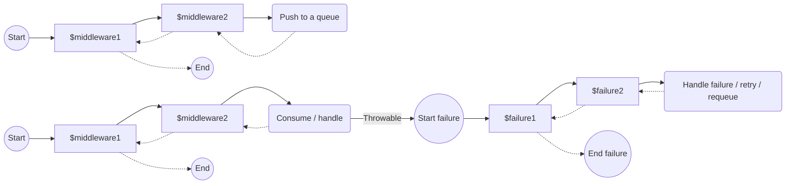

# Middleware pipelines

Yii Queue uses middlewares to run custom logic around message pushing and message processing.

A middleware is a piece of code that receives a request object and can either:

- change the request (for example, change the message, adapter, or error handling behavior) and continue the pipeline, or
- stop the pipeline by returning without calling the next handler.

This is similar to HTTP middleware, but it is applied to queue messages.

## What middlewares are for

Common reasons to add middlewares:

- **Collect metrics**
  You can count pushed/processed messages, measure handler duration, or measure time between push and consume.
- **Add tracing / correlation data**
  You can put trace ids or correlation ids into message metadata so logs from producer/consumer are connected.
- **Logging and observability**
  You can log message ids, channels, attempts, and failures in a consistent way.
- **Modify the message payload**
  You can obfuscate sensitive data, normalize payload, add extra fields required by consumers, or wrap a message into envelopes.
- **Route and schedule**
  You can switch channel, choose a different adapter, or add delay when the adapter supports it.

## Pipelines overview

Each message may pass through three independent pipelines:

- **Push pipeline** (executed when calling `QueueInterface::push()`).
- **Consume pipeline** (executed when a worker processes a message).
- **Failure handling pipeline** (executed when message processing throws a `Throwable`).

The execution order inside a pipeline is forward in the same order you configured middlewares.



## How to define a middleware

You can use any of these formats:

- A ready-to-use middleware object.
- An array in the format of [yiisoft/definitions](https://github.com/yiisoft/definitions).
- A `callable` (closure, invokable object, `[$object, 'method']`, etc.). It is executed through the
  [yiisoft/injector](https://github.com/yiisoft/injector), so its dependencies are resolved automatically.
- A string for your DI container to resolve the middleware, e.g. `FooMiddleware::class`.

The required interface depends on the pipeline:

- Push: `Yiisoft\Queue\Middleware\Push\MiddlewarePushInterface`
- Consume: `Yiisoft\Queue\Middleware\Consume\MiddlewareConsumeInterface`
- Failure handling: `Yiisoft\Queue\Middleware\FailureHandling\MiddlewareFailureInterface`

## Push pipeline

The push pipeline is executed when calling `QueueInterface::push()`.

Push middlewares can:

- Modify the message (wrap it into envelopes, add metadata, obfuscate data, etc.).
- Modify the adapter (change channel, add delay, route to a different backend, etc.).

In particular, push middlewares may define or replace the adapter that will be used to push the message. This can be useful when:

- You choose a backend dynamically (for example, based on message type or payload).
- You route messages to different channels/backends (for example, `critical` vs `low`).
- You apply scheduling/delay logic in a middleware.

The adapter is set by returning a modified request:

```php
return $pushRequest->withAdapter($adapter);
```

### Adapter must be configured by the end of the pipeline

The pipeline ends with a final handler that actually pushes the message using the adapter.

If the adapter is not configured by the time the pipeline reaches the final handler,
`Yiisoft\Queue\Exception\AdapterNotConfiguredException` is thrown.

### Custom push middleware

Implement `MiddlewarePushInterface` and return a modified `PushRequest` from `processPush()`:

```php
return $pushRequest
    ->withMessage($newMessage)
    ->withAdapter($newAdapter);
```

## Consume pipeline

The consume pipeline is executed by the worker while processing a message.

Consume middlewares are often used to modify the message and/or collect runtime information:

- Measure handler execution time.
- Add correlation ids and include them into logs.
- Convert thrown exceptions into domain-specific failures.

The final handler of the consume pipeline invokes the resolved message handler.

## Failure handling pipeline

When a `Throwable` escapes the consume pipeline, the worker switches to the failure handling pipeline.

The pipeline receives a `FailureHandlingRequest` that contains:

- the message
- the caught exception
- the queue instance

The pipeline is selected by queue channel; if there is no channel-specific pipeline configured,
`FailureMiddlewareDispatcher::DEFAULT_PIPELINE` is used.

See [Failure handling pipeline](failure-handling-pipeline.md) for the step-by-step flow and built-in middlewares.

## Configuration

### With yiisoft/config

When using [yiisoft/config](https://github.com/yiisoft/config), pipelines are configured in params under `yiisoft/queue`:

- `middlewares-push`
- `middlewares-consume`
- `middlewares-fail`

See [Configuration with yiisoft/config](configuration-with-config.md) for examples.

### Manual configuration (without yiisoft/config)

When configuring the component manually, you instantiate the middleware dispatchers and pass them to `Queue` / `Worker`.

See [Manual configuration](configuration-manual.md) for a full runnable example.

## Runtime overrides

You can override middleware stacks at runtime:

- `Queue::withMiddlewares(...)` replaces the whole push middleware stack for that queue instance.
- `Queue::withMiddlewaresAdded(...)` appends middlewares to the existing stack.

These methods affect only the push pipeline of that `Queue` instance.
