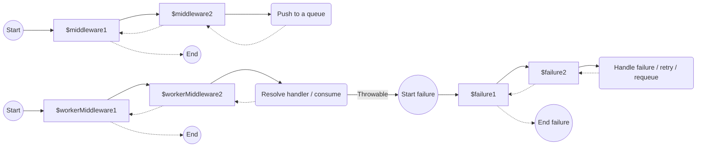

# Middleware pipelines

Yii Queue uses middlewares to run custom logic around message pushing and message processing.

A middleware is a piece of code that receives a request object and can either:

- return a modified request (for example, one with a changed message or error-handling data) and continue the pipeline, or
- stop the pipeline by returning without calling the next handler.

The pipeline mechanism is similar to HTTP middleware, but applied to queue messages.

## What middlewares are for

Common reasons to add middlewares:

- **Collect metrics**
  You can count pushed/processed messages, measure handler duration, or measure time between push and consume.
- **Add tracing / correlation data**
  You can put trace ids or correlation ids into message metadata so logs from producer/consumer are connected.
- **Logging and observability**
  You can log message ids, queue names, attempts, and failures in a consistent way.
- **Modify the message payload**
  You can obfuscate sensitive data, normalize payload, add extra fields required by consumers, or wrap a message into envelopes.
- **Schedule**
  You can add delay when the adapter supports it.

## Pipelines overview

A message may pass through four independent pipelines:

- **Push pipeline** (executed when a producer pushes a message).
- **Worker pipeline** (executed by `Worker` before handler resolution).
- **Consume pipeline** (executed while the worker invokes the resolved handler).
- **Failure handling pipeline** (executed when message processing throws a `Throwable`).

The execution order inside a pipeline is forward in the same order you configured middlewares.


```mermaid
graph LR
    StartPush((Start)) --> PushMiddleware1[$middleware1] --> PushMiddleware2[$middleware2] --> Push(Push to a queue)
    -.-> PushMiddleware2[$middleware2] -.-> PushMiddleware1[$middleware1]
    PushMiddleware1[$middleware1] -.-> EndPush((End))


    StartWorker((Start)) --> WorkerMiddleware1[$workerMiddleware1] --> WorkerMiddleware2[$workerMiddleware2] --> Consume(Resolve handler / consume)
    -.-> WorkerMiddleware2[$workerMiddleware2] -.-> WorkerMiddleware1[$workerMiddleware1]
    WorkerMiddleware1[$workerMiddleware1] -.-> EndWorker((End))


    Consume -- Throwable --> StartFailure((Start failure))
    StartFailure --> FailureMiddleware1[$failure1] --> FailureMiddleware2[$failure2] --> Failure(Handle failure / retry / requeue)
    -.-> FailureMiddleware2[$failure2] -.-> FailureMiddleware1[$failure1]
    FailureMiddleware1[$failure1] -.-> EndFailure((End failure))
```

## How to define a middleware

You can use any of these formats:

- A ready-to-use middleware object.
- An array in the format of [yiisoft/definitions](https://github.com/yiisoft/definitions), which defines a middleware implementation.
- A string for your DI container to resolve the middleware, e.g. `FooMiddleware::class`.
- An [extended callable definition](callable-definitions-extended.md). A callable should either be a middleware itself or return a configured middleware object.

> **Note:** The formats above are supported by the default `PushMiddlewareFactory`. When using a custom
> `PushMiddlewareFactoryInterface` implementation, it may accept additional definition formats.

The required interface depends on the pipeline:

- Push: `Yiisoft\Queue\Middleware\Push\PushMiddlewareInterface`
- Worker: `Yiisoft\Queue\Middleware\Worker\WorkerMiddlewareInterface`
- Consume: `Yiisoft\Queue\Middleware\Consume\ConsumeMiddlewareInterface`
- Failure handling: `Yiisoft\Queue\Middleware\FailureHandling\FailureMiddlewareInterface`

## Push pipeline

The push pipeline is a request-in/request-out pipeline. It receives a `PushRequest` and returns a `PushRequest`; requests are immutable. The request normalizes the logical queue identity once, so `getQueueName()` always returns the same normalized queue key throughout the pipeline.

Push middlewares can modify the message, for example by wrapping it in envelopes or adding metadata. The normalized queue identity in `PushRequest` is immutable: push middleware cannot switch queues or adapters. The adapter final handler performs the push and returns the adapter-returned message in the resulting request.

### Custom push middleware

Implement `PushMiddlewareInterface` and return a modified `PushRequest` from `processPush()`:

```php
public function processPush(PushRequest $request, PushHandlerInterface $handler): PushRequest
{
    $result = $handler->handlePush($request);
    return $result->withMessage($this->normalize($result->getMessage()));
}
```

`PushRequest` has no mutable adapter or queue field. Adapter and queue selection belong to producer configuration; the final handler preserves the message returned by that adapter.

## Worker pipeline

The worker pipeline is a separate request-in/request-out pipeline. `Worker` runs it before resolving the message handler. The resolved handler is then processed by the consume pipeline; if processing throws, the failure handling pipeline runs. Worker-level instrumentation and processing event semantics belong here. Configure it with `middlewares-worker`.

Implement `WorkerMiddlewareInterface` and return a `WorkerRequest` from `processWorker()`.

## Consume pipeline

The consume pipeline is a request-in/request-out pipeline executed by `Worker` while processing a message, after the worker pipeline and handler resolution.

Consume middlewares are often used to modify the message and/or collect runtime information:

- Measure handler execution time.
- Add correlation ids and include them into logs.
- Convert thrown exceptions into domain-specific failures.

The final handler of the consume pipeline invokes the resolved message handler.

## Failure handling pipeline

When a `Throwable` escapes the consume pipeline, the worker switches to the failure handling pipeline.

The pipeline receives a `FailureHandlingRequest` that contains:

- the message
- the caught exception
- the normalized queue name
- an optional typed retry `Closure(MessageInterface): MessageInterface`

It does not contain a queue instance.

The pipeline is selected by queue name; if there is no queue-specific pipeline configured,
`FailureMiddlewareDispatcher::DEFAULT_PIPELINE` is used.

See [Error handling on message processing](error-handling.md) for the step-by-step flow and built-in middlewares.

## Configuration

### With yiisoft/config

When using [yiisoft/config](https://github.com/yiisoft/config), pipelines are configured in params under `yiisoft/queue`:

- `middlewares-push`
- `middlewares-worker`
- `middlewares-consume`
- `middlewares-fail`

See [Configuration with yiisoft/config](configuration-with-config.md) for examples.

### Manual configuration (without yiisoft/config)

When configuring the component manually, you instantiate the middleware dispatchers and pass them to `SyncQueueProducer` / `AsyncQueueProducer`, `QueueConsumer`, and `Worker` as appropriate.

See [Manual configuration](configuration-manual.md) for a full runnable example.
